# Gestor Clinica Angular

## Descripción del proyecto
La aplicación da la posibilidad de completar el ciclo completo de los turnos, pacientes y gestionarlos en distintas pantallas dependiendo el rol que tengas como usuario registrado.

## Funcionalidades específicas
### Página de bienvenida, para usuarios no logueados
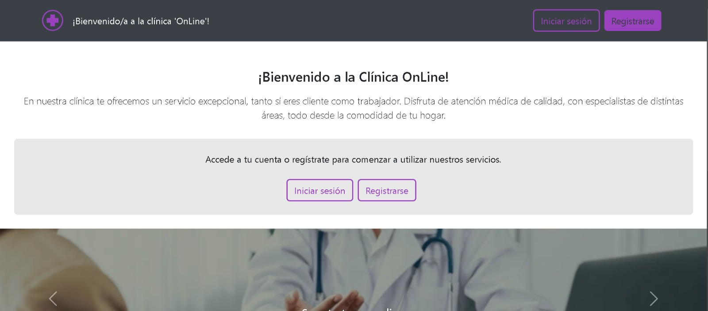

### Página de login
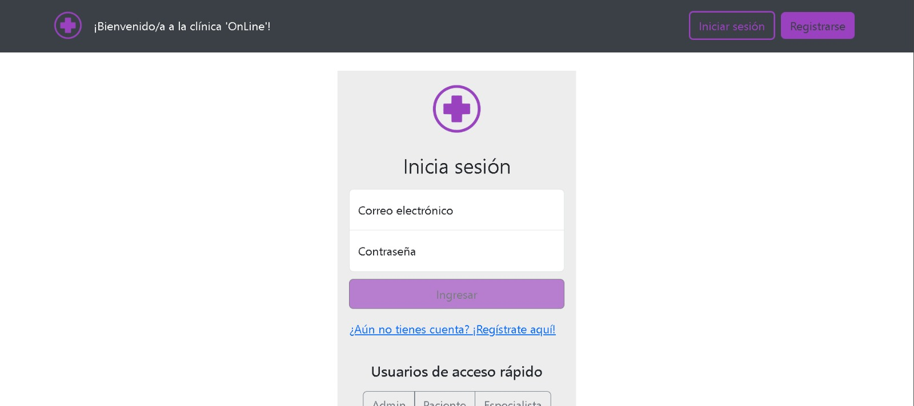
En este login podras iniciar sesión con credenciales propias o con las hardcodeadas por la app para inicio rápido

### Página de registro
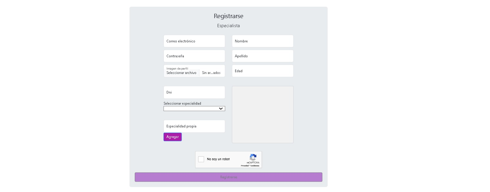
En este registro podras dar de alta usuarios del tipo especialista o paciente con captcha y validaciones incluidas

### Página sobre mi
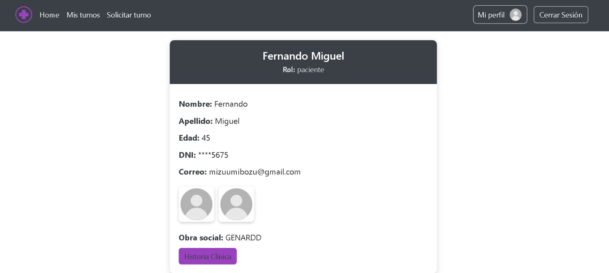
En este página encontrarás toda la información detallada sobre el usuario con la sesión actual, así como una historia clinia para pacientes y seleccion de horarios para especialistas

### Página turnos alta
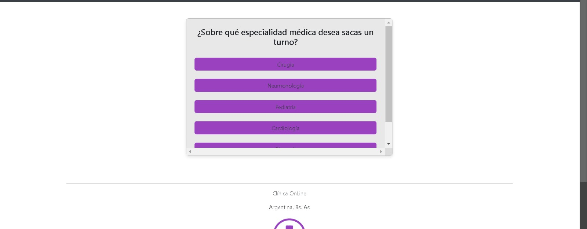
En este página podra el paciente o admin dar de alta un nuevo turno con el especialista, especialidad y fecha deseado!!

### Página turnos lectura
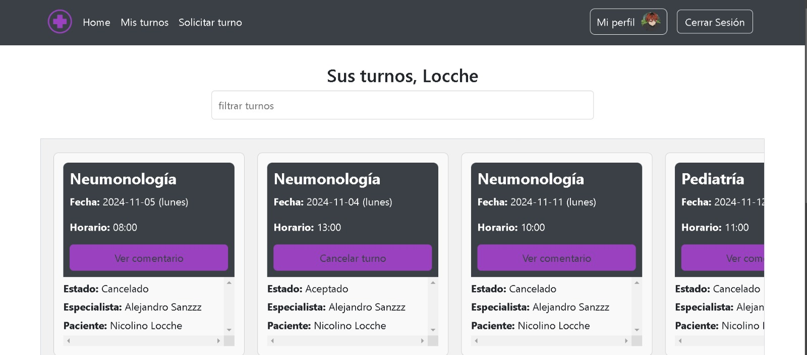
En este página podra el paciente podrá ver sus turnos, el estado del mismo, y según ese estado accedera a lectura de comentarios, diagnósticos o encuestas. El especialista también verá sus turnos

### Página seccion usuarios
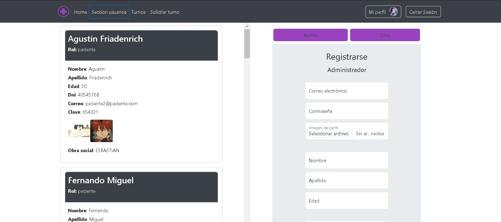
En esta página exclusiva para administradores, estos podrán permitir los intentos de registro de nuevos usuarios especialistas así como registrar cualquier tipo de usuario nuevo.

### Página historia clinica
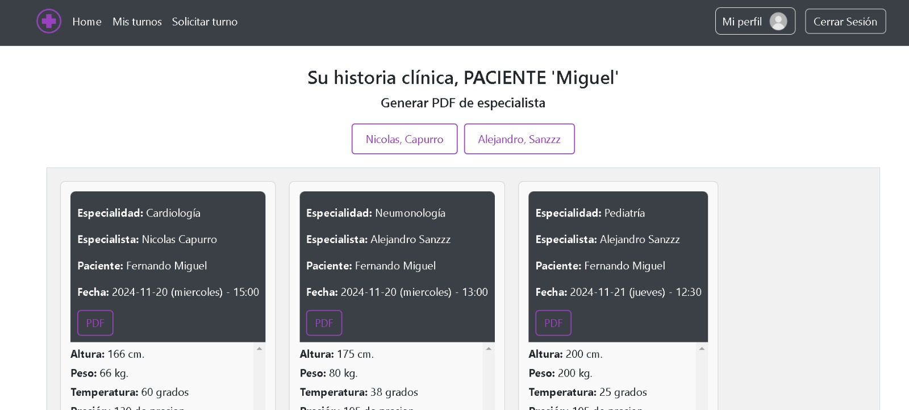
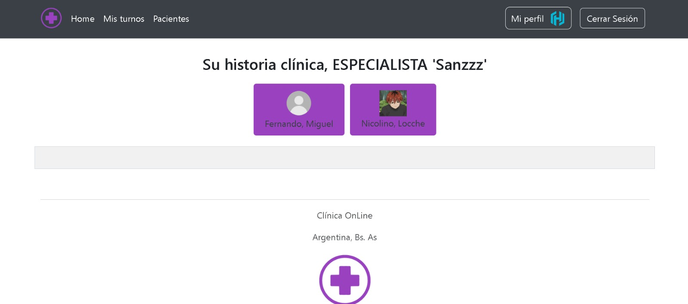
En esta página podran ver las historias clinicas suyas los pacientes y especialistas ademas de poder filtrar con características exclusivas 

### Página estadísticas
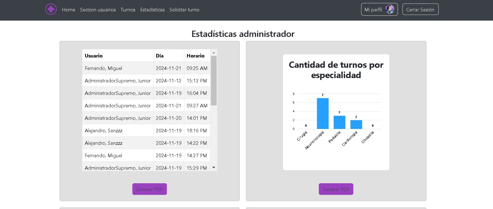
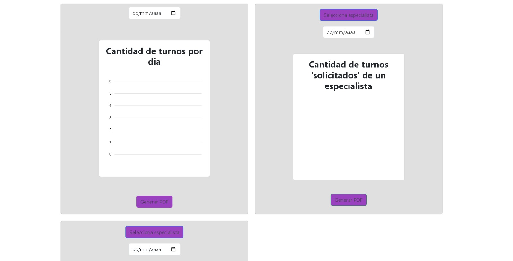
En esta página 

##### ¡¡En varias secciones se pueden descargar excels y PDF sobre las diferentes funcionalidades con características sorprendentes!!

### Creada por: Mariano Guevara